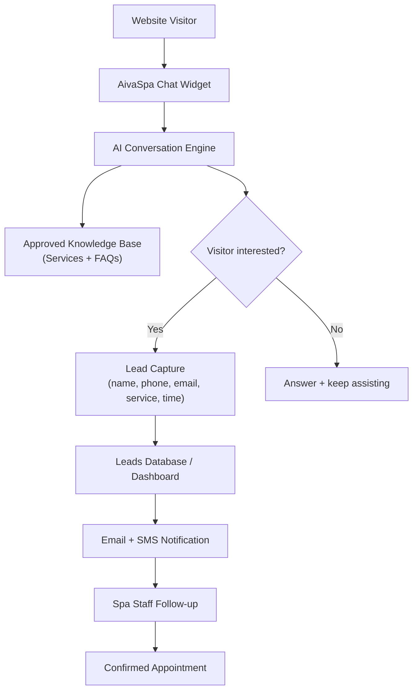
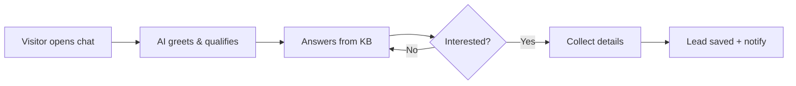
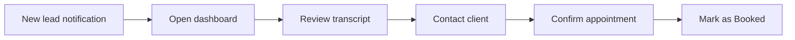

<aside>
📄

**Product Requirements Document — v1.0**

**Product:** AivaSpa — 24/7 AI Receptionist & Lead Capture Assistant for Med Spas

**Owner:** Wff Gaming · **Status:** Draft · **Last updated:** 7 Jun 2026

</aside>

> **One-liner:** AivaSpa is a 24/7 AI receptionist that lives on a med spa's website — it answers visitor questions about treatments, pricing, and timing, then captures booking/consultation leads and routes them to staff instantly.
> 

## 1. Executive Summary

Med spas lose a large share of potential clients because website visitors arrive with questions (Botox, fillers, laser, pricing, availability) but there is no one to respond instantly — especially after hours. AivaSpa solves this with a website chat widget powered by an AI receptionist that:

- Greets and qualifies every visitor in natural language.
- Answers questions strictly from an **approved knowledge base** of services and FAQs.
- Captures qualified leads (name, phone, email, service interest, preferred time).
- Saves leads to a dashboard and instantly notifies the owner via **Email/SMS**.
- Hands off to staff to confirm the appointment.

The outcome: **more booked consultations, zero missed after-hours leads, and reduced front-desk workload.**

## 2. Problem Statement

| Problem | Impact on Med Spa |
| --- | --- |
| Visitors leave without contacting anyone | Lost revenue, low website conversion |
| No response after business hours | After-hours leads go to competitors |
| Front desk is busy / overwhelmed | Slow replies, missed calls, staff burnout |
| Inconsistent answers about pricing/services | Compliance risk + confused prospects |
| Leads are scattered (DMs, calls, forms) | No central pipeline, poor follow-up |

## 3. Goals & Success Metrics

### Product Goals

1. Capture every interested website visitor as a structured lead.
2. Provide instant, accurate, on-brand answers 24/7.
3. Make follow-up effortless for spa staff.
4. Keep the experience compliant and safe (no medical/pricing overpromises).

### Key Metrics (KPIs)

| Metric | Target |
| --- | --- |
| Visitor → Lead conversion rate | ≥ 12% |
| Lead → Booked consultation rate | ≥ 35% |
| After-hours leads captured | ≥ 30% of total leads |
| Avg. first-response time | < 3 seconds |
| Answer accuracy (from approved KB) | ≥ 95% |
| Owner notification delivery time | < 60 seconds |

## 4. Target Users & Personas

<aside>
💼

**Med Spa Owner / Manager**

Wants more booked clients, fewer missed leads, and visibility into the pipeline. Buys and configures AivaSpa.

</aside>

<aside>
💁

**Front Desk / Staff**

Receives qualified leads, follows up, confirms appointments. Needs a simple dashboard + notifications.

</aside>

<aside>
🧑

**Website Visitor (Prospect)**

Curious about treatments/pricing. Wants instant answers and an easy way to book.

</aside>

## 5. How The System Works (End-to-End)

### 5.1 Step-by-step flow

1. Med spa owner installs the AivaSpa **chat widget** on their website (one script snippet).
2. A visitor lands on the website.
3. AivaSpa greets them: *“Hi! Are you looking to book a consultation or ask about a treatment?”*
4. Visitor asks about Botox, fillers, laser, pricing, timing, or booking.
5. AI answers based on the spa's **approved FAQs & services** knowledge base.
6. If the visitor is interested, AI collects: **name, phone, email, service interest, preferred time.**
7. The lead is saved to the med spa's **dashboard**.
8. The owner/staff receives an **Email + SMS** notification.
9. Staff contacts the client and confirms the appointment.

### 5.2 System architecture diagram

### 5.3 Sample conversation

<aside>
💬

**Visitor:** Do you offer Botox?

**AivaSpa:** Yes, we offer Botox consultations. Would you like to book one?

**Visitor:** How much?

**AivaSpa:** Pricing depends on the units needed. A licensed provider can confirm exact pricing during your consultation. May I collect your details to set it up?

**Visitor:** Sure.

**AivaSpa:** Great! What's your name, phone, and a preferred time? *(captures lead)*

</aside>

## 6. Functional Requirements

### 6.1 Chat Widget

- [ ]  Embeddable via a single `<script>` snippet.
- [ ]  Floating launcher button (bottom-right), customizable position.
- [ ]  Mobile responsive, fast load (lazy-loaded, < 50KB initial).
- [ ]  Branded with spa logo, colors, and welcome message.
- [ ]  Proactive greeting after X seconds (configurable).

### 6.2 AI Conversation Engine

- [ ]  Natural-language understanding of visitor intent (info vs. booking).
- [ ]  Answers ONLY from the approved knowledge base; never invents pricing/medical claims.
- [ ]  Graceful fallback: *“A team member can help with that — let me take your details.”*
- [ ]  Multi-turn memory within a session.
- [ ]  Detects buying intent and triggers lead capture.

### 6.3 Lead Capture

- [ ]  Collects: name, phone, email, service interest, preferred time, optional notes.
- [ ]  Validates phone/email format.
- [ ]  Saves partial leads (even if visitor drops off mid-flow).
- [ ]  Tags lead source (page URL, after-hours flag, service).

### 6.4 Dashboard (Owner/Staff)

- [ ]  Leads inbox with status: New → Contacted → Booked → Lost.
- [ ]  Lead detail view + full chat transcript.
- [ ]  Search & filter (by service, date, status).
- [ ]  Knowledge base / FAQ editor (services, pricing rules, hours).
- [ ]  Widget appearance & greeting settings.
- [ ]  Team member management & roles.
- [ ]  Basic analytics (leads, conversion, response time).

### 6.5 Notifications

- [ ]  Instant Email to owner/staff on new lead.
- [ ]  Instant SMS to owner/staff on new lead.
- [ ]  Daily summary email (optional).
- [ ]  Configurable recipients per notification type.

### 6.6 Integrations (Phase-based)

- [ ]  Calendar/booking (Google Calendar, Calendly, or native booking) — *Phase 2*.
- [ ]  CRM export (CSV, Zapier/webhooks) — *Phase 2*.
- [ ]  SMS provider (Twilio) and Email provider (SendGrid/Postmark).

## 7. Non-Functional Requirements

| Category | Requirement |
| --- | --- |
| Performance | AI first response < 3s; widget load < 1s |
| Availability | 99.9% uptime; 24/7 operation |
| Scalability | Handle concurrent chats across many spas (multi-tenant) |
| Security | Encrypted in transit (TLS) & at rest; role-based access |
| Privacy/Compliance | Consent capture, data retention controls, HIPAA-aware handling of PII |
| Reliability | Leads never lost; queued retries for notifications |
| Accessibility | WCAG 2.1 AA for widget & dashboard |

## 8. Compliance & Safety Guardrails

<aside>
⚠️

**Critical for a medical/aesthetic business.** AivaSpa must never act as a medical provider.

</aside>

- AI must **not** give medical advice, diagnoses, or guaranteed outcomes.
- AI must **not** quote firm prices — always defer to a licensed provider during consultation.
- Display a disclaimer: *“Information provided is general; a licensed provider confirms treatment suitability and pricing.”*
- Collect explicit consent before storing contact details (privacy notice link).
- Support data deletion requests and configurable retention windows.
- Keep an audit log of conversations for compliance review.

## 9. Data Model — Lead

| Field | Type | Notes |
| --- | --- | --- |
| lead_id | UUID | Primary key |
| name | Text | Required |
| phone | Text | Validated |
| email | Text | Validated |
| service_interest | Select | Botox, Fillers, Laser, etc. |
| preferred_time | Datetime / Text | Visitor's choice |
| status | Select | New / Contacted / Booked / Lost |
| source_url | Text | Page lead came from |
| after_hours | Boolean | Captured outside business hours |
| transcript | Text | Full chat log |
| created_at | Datetime | Auto |

## 10. Design System (from landing page reference)

<aside>
🎨

The reference landing page uses a **dark, modern, minimal** aesthetic (near-black background, crisp white text, soft gray secondary text, subtle borders, and a single vivid accent). This same palette and typography must be applied across the **entire AivaSpa website and dashboard**.

</aside>

### 10.1 Color palette

| Token | Hex | Usage |
| --- | --- | --- |
| --bg-base | #08090A | Page background (near-black) |
| --bg-surface | #121316 | Cards / sections |
| --bg-elevated | #1A1B1E | Modals, popovers, chat widget |
| --border | #23252A | Hairline borders / dividers |
| --text-primary | #F7F8F8 | Headings & key text (white) |
| --text-secondary | #8A8F98 | Body / muted text (gray) |
| --text-tertiary | #62666D | Captions, hints |
| --accent-primary | #5E6AD2 | Primary buttons, links, focus (indigo) |
| --accent-highlight | #E2E54B | CTA highlight / emphasis (yellow) |
| --success | #4CB782 | Booked / positive states |
| --danger | #EB5757 | Errors / lost leads |

### 10.2 Typography

- **Primary typeface:** Inter (UI, body, headings) — clean geometric sans, matching the reference.
- **Fallback stack:** `Inter, -apple-system, "Segoe UI", Roboto, Helvetica, Arial, sans-serif`.
- **Scale:** Display 48–64px / H1 36px / H2 28px / H3 20px / Body 16px / Caption 13px.
- **Weights:** 600/700 for headings, 400/500 for body. Tight letter-spacing on large headings.
- **Style notes:** Generous spacing, high contrast, subtle gradients, thin borders, large hero with product screenshot.

### 10.3 UI principles

- Dark-first, minimal, lots of negative space.
- One accent color for primary actions; yellow used sparingly for the strongest CTA.
- Rounded corners (8–12px), soft shadows, hairline borders.
- Crisp product screenshots framed in subtle gradient containers.

## 11. Landing Page Spec (AivaSpa)

Mirror the reference layout exactly, with AivaSpa's content:

1. **Top nav** — logo "AivaSpa", links (Product, Features, Pricing, FAQ), Login + "Get started" button.
2. **Hero** — Headline: *“The 24/7 AI receptionist for med spas.”* Subtext + primary CTA + product screenshot of the chat widget/dashboard.
3. **Logo strip** — "Trusted by modern med spas".
4. **Value section** — 3 columns: *Built for med spas · Powered by AI · Designed for bookings*.
5. **Feature blocks** (alternating image/text):
    - Make lead capture self-driving
    - Answer treatment questions instantly
    - Move every lead into a booked consultation
    - Understand your pipeline at a glance
6. **Dashboard preview** — analytics + leads inbox screenshot.
7. **Testimonials** — 2 quote cards (one on yellow highlight, one on dark).
8. **Closing CTA** — *“Built for growth. Available today.”* Get started + Contact sales.
9. **Footer** — product, features, company, resources, connect.

## 12. User Flows

### 12.1 Visitor → Lead

### 12.2 Staff → Booking

## 13. Tech Stack (proposed)

| Layer | Choice |
| --- | --- |
| Widget | Lightweight JS (vanilla/Preact), embeddable script |
| Frontend (dashboard + site) | Next.js + Tailwind (dark theme tokens) |
| Backend/API | Node.js (serverless or Nest) |
| AI | LLM with retrieval over approved KB (RAG) |
| Database | Postgres (multi-tenant) + vector store for KB |
| Notifications | Twilio (SMS) + SendGrid/Postmark (Email) |
| Hosting | Vercel / AWS |

## 14. Roadmap

| Phase | Scope | Outcome |
| --- | --- | --- |
| MVP | Widget, AI Q&A, lead capture, dashboard inbox, email+SMS | Capture & notify leads 24/7 |
| Phase 2 | Calendar/booking integration, CRM export, analytics | Reduce manual follow-up |
| Phase 3 | Multi-language, A/B greetings, SMS two-way follow-up, AI auto-booking | Higher conversion & automation |

## 15. Risks & Mitigations

| Risk | Mitigation |
| --- | --- |
| AI gives wrong medical/pricing info | Strict KB-only answers + disclaimers + guardrails |
| Spam / fake leads | Validation, rate limiting, optional captcha |
| PII privacy concerns | Consent capture, encryption, retention controls |
| Low adoption by staff | Simple dashboard + clear notifications |
| Notification failures | Retry queue + delivery logging |

## 16. Open Questions

- [ ]  Native booking calendar vs. integrate Calendly/Google?
- [ ]  How many languages at launch (English only vs. multi-lingual)?
- [ ]  Pricing model for AivaSpa (per spa / per lead / tiered)?
- [ ]  HIPAA-grade hosting required from day one?

---

<aside>
✅

**Definition of Done (MVP):** A med spa can embed the widget, the AI answers from their FAQs, qualified leads are captured + stored, and the owner gets an instant Email + SMS — all in the dark AivaSpa theme.

</aside>